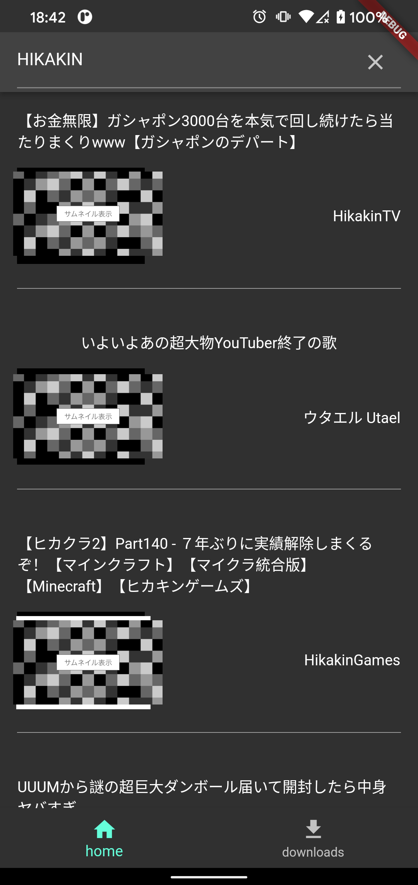
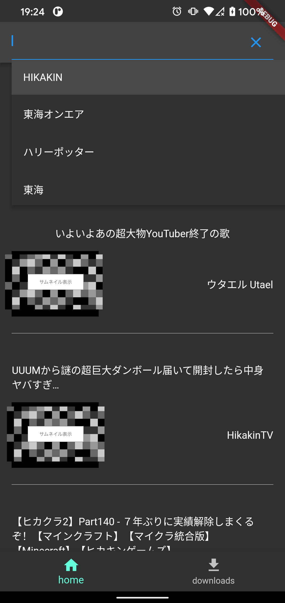
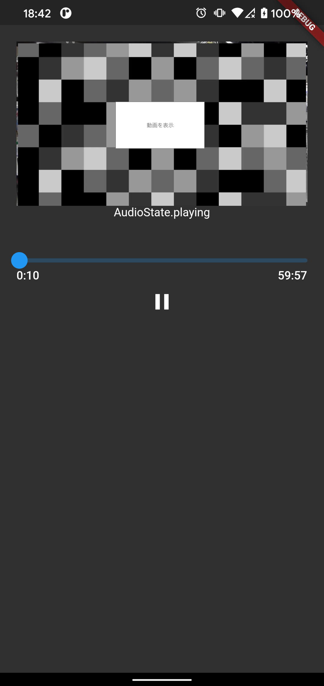

# handy_player
※ビルドするためにenvファイルが必要です。

## 機能
* Youtubeの動画再生を行えます。
* バックグラウンドでの再生が行えます。
* 音声再生位置をローカルに保存し、再度再生を行う際は保存した位置から再生できます。

## スクリーンショット

### トップ画面

* サムネイルの表示、タイトルの表示を行います。

### 検索

* 検索履歴を表示します。

### 再生確認

### 再生画面

* 動画を再生します。

### 未対応箇所
* 現在IOSは動作しません。
* 再生画面でシークバーを動かした時に映像の同期が取れていません。そのため音ズレすることが多々あります。
